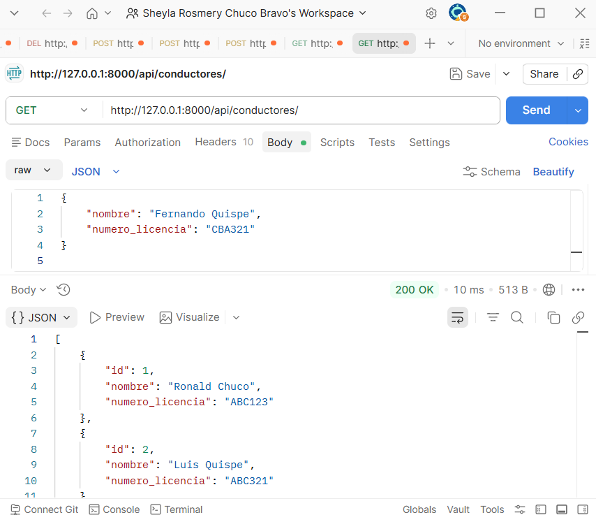
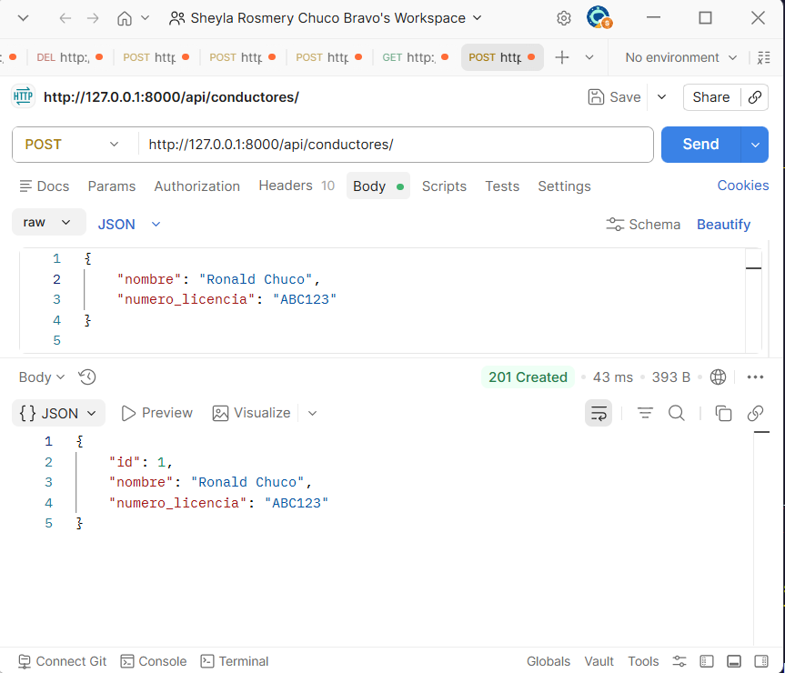
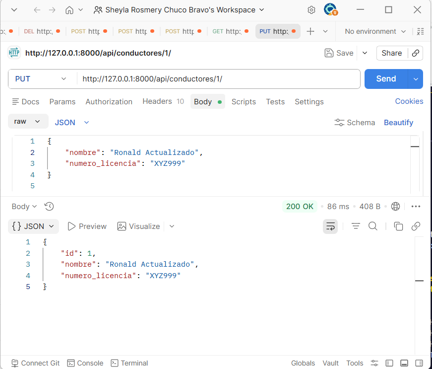
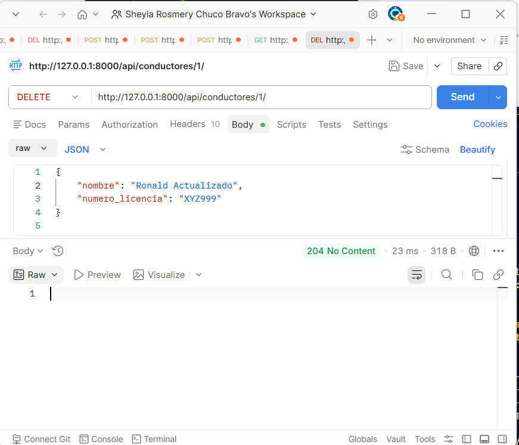
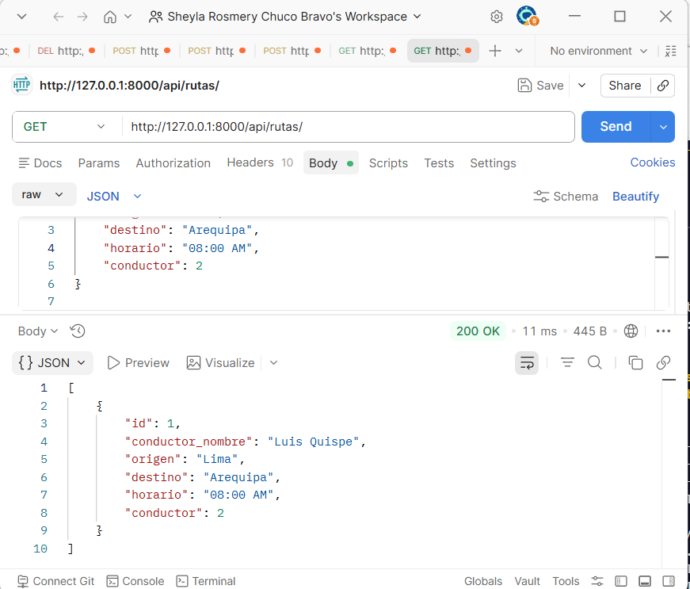
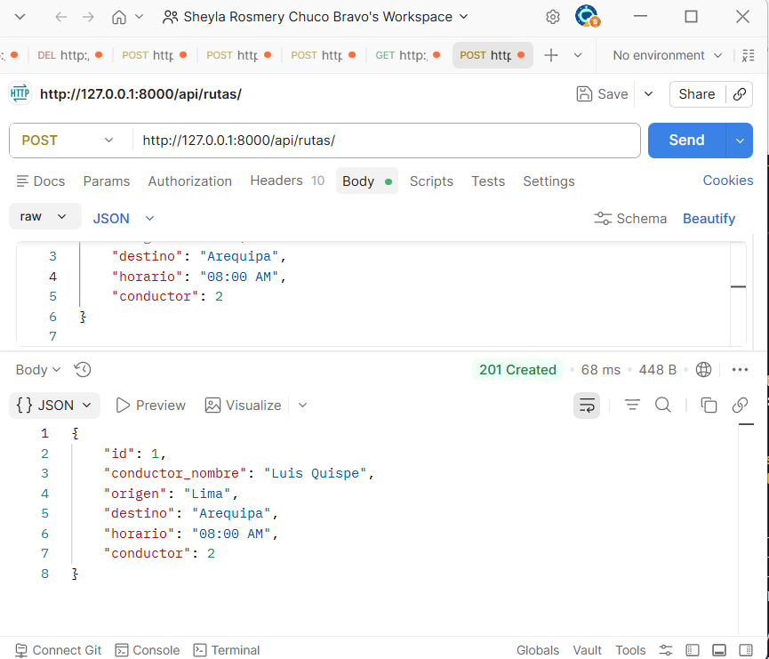
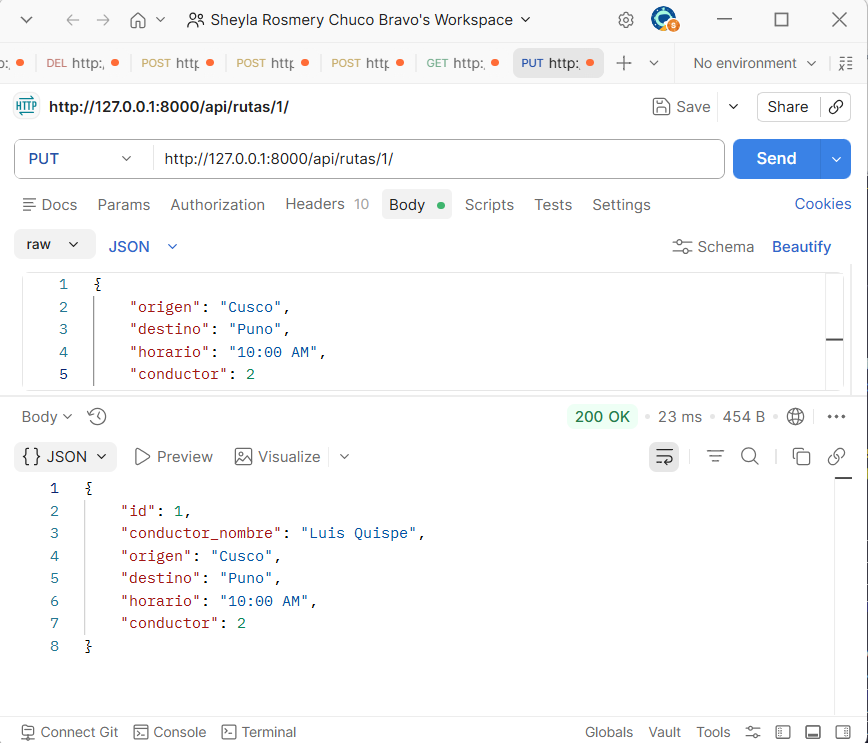
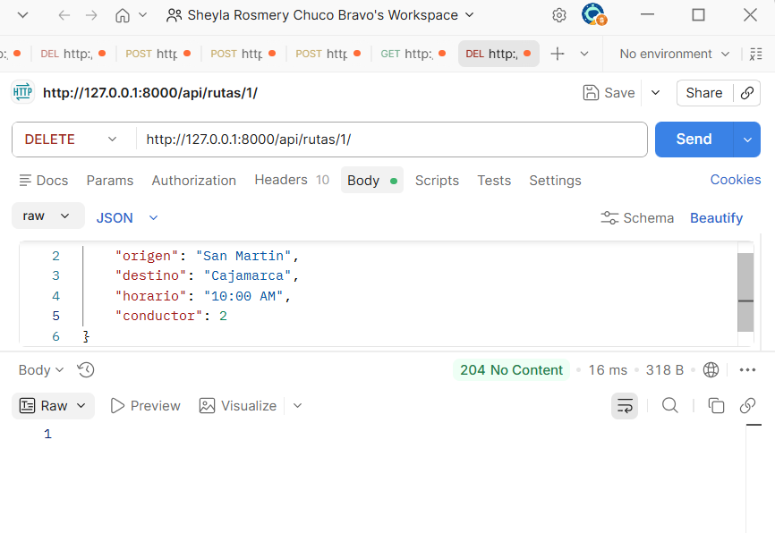
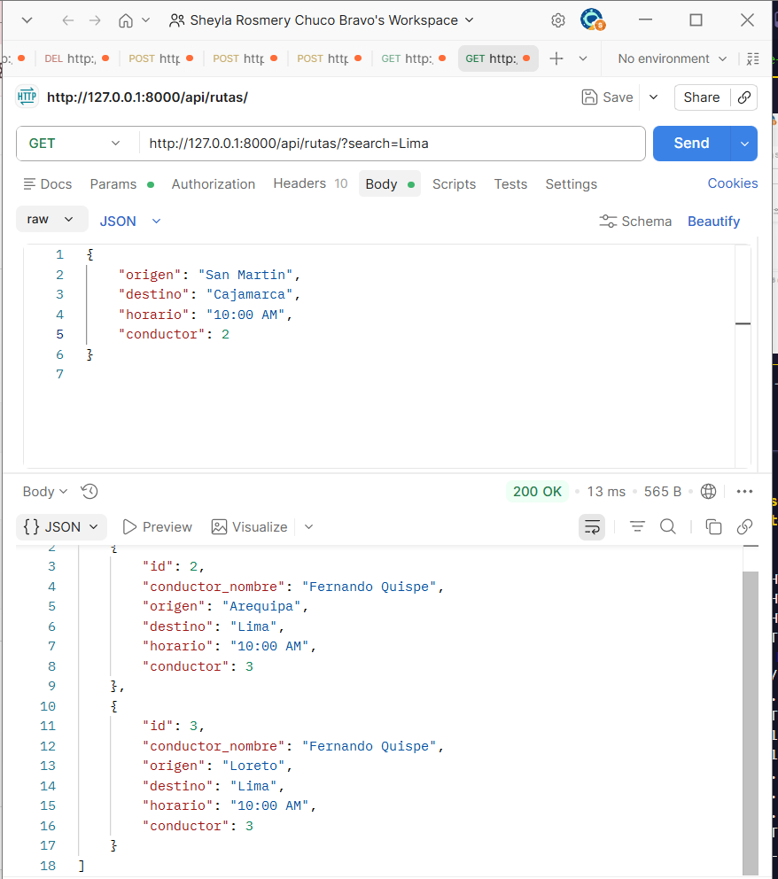
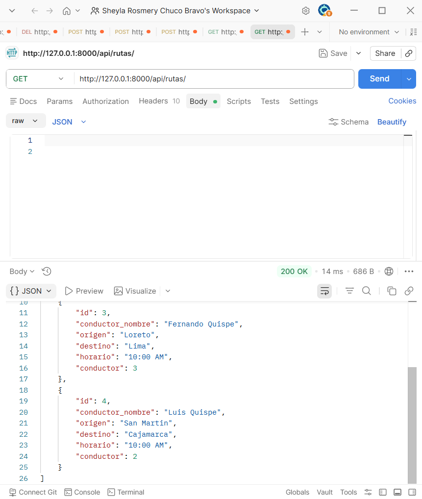

# 🚛 TransitTrack API

API REST desarrollada con Django Rest Framework para la gestión de rutas y conductores de transporte.

---

# 📌 Descripción del Proyecto

TransitTrack API es un sistema backend que permite administrar rutas de transporte y conductores mediante una API RESTful.

El proyecto fue desarrollado utilizando Django Rest Framework siguiendo buenas prácticas de desarrollo backend, arquitectura modular y control de versiones con Git y GitHub.

---

# 🚀 Tecnologías Utilizadas

- Python 3
- Django
- Django Rest Framework
- SQLite3
- Git# 🚛 TransitTrack API

API REST desarrollada con Django Rest Framework para la gestión de rutas y conductores de transporte.

---

# 📌 Descripción del Proyecto

TransitTrack API es una aplicación backend desarrollada con Django Rest Framework que permite administrar información relacionada con rutas de transporte y conductores mediante operaciones CRUD RESTful.

El sistema fue construido siguiendo buenas prácticas de desarrollo backend, organización modular, control de versiones con Git y documentación técnica utilizando README.md.

El proyecto permite:

✅ Registrar conductores  
✅ Registrar rutas de transporte  
✅ Relacionar rutas con conductores  
✅ Buscar rutas por origen o destino  
✅ Realizar operaciones CRUD completas  
✅ Consumir la API mediante Postman  

---

# 🚀 Tecnologías Utilizadas

- Python 3
- Django
- Django Rest Framework
- SQLite3
- Git
- GitHub
- Postman
- VS Code

---

# 📂 Estructura del Proyecto

```bash
transitrack_api/
│
├── conductores/
│   ├── migrations/
│   ├── models.py
│   ├── serializers.py
│   ├── views.py
│   ├── urls.py
│
├── rutas/
│   ├── migrations/
│   ├── models.py
│   ├── serializers.py
│   ├── views.py
│   ├── urls.py
│
├── docs/
│   ├── 01-get-conductores.png
│   ├── 02-post-conductor.png
│   ├── 03-put-conductor.png
│   ├── 04-delete-conductor.png
│   ├── 05-get-rutas.png
│   ├── 06-post-ruta.png
│   ├── 07-put-ruta.png
│   ├── 08-delete-ruta.png
│   ├── 09-search-ruta.png
│   └── 10-relacion-ruta-conductor.png
│
├── config/
│
├── manage.py
├── requirements.txt
├── README.md
└── .gitignore
```

---

# ⚙️ Instalación y Configuración

# 1️⃣ Clonar repositorio

```bash
git clone https://github.com/SheylaChuco/transitrack_apii.git
```

---

# 2️⃣ Ingresar al proyecto

```bash
cd transitrack_api
```

---

# 3️⃣ Crear entorno virtual

```bash
python -m venv venv
```

---

# 4️⃣ Activar entorno virtual

## Windows

```bash
venv\Scripts\activate
```

---

# 5️⃣ Instalar dependencias

```bash
pip install -r requirements.txt
```

---

# 6️⃣ Ejecutar migraciones

```bash
python manage.py makemigrations
python manage.py migrate
```

---

# 7️⃣ Ejecutar servidor

```bash
python manage.py runserver
```

---

# 🌐 URL Base de la API

```bash
http://127.0.0.1:8000/
```

---

# 📌 Funcionalidades Implementadas

✅ CRUD completo de conductores  
✅ CRUD completo de rutas  
✅ Relación entre rutas y conductores  
✅ Filtro de búsqueda por origen y destino  
✅ Respuestas JSON  
✅ API RESTful  
✅ Serializers con Django Rest Framework  
✅ Generic Views  
✅ URLs organizadas por aplicación  

---

# 🗄️ Modelos del Sistema

# 🚛 Modelo Conductor

| Campo | Tipo |
|---|---|
| nombre | CharField |
| numero_licencia | CharField |

---

# 🚛 Modelo Ruta

| Campo | Tipo |
|---|---|
| origen | CharField |
| destino | CharField |
| horario | CharField |
| conductor | ForeignKey |

---

# 🔗 Relación entre Entidades

Cada ruta está asociada a un conductor mediante una relación `ForeignKey`.

Esto permite:

- Un conductor puede tener múltiples rutas.
- Una ruta pertenece a un solo conductor.

---

# 📌 Endpoints de la API

# 🚛 Conductores

| Método | Endpoint | Descripción |
|---|---|---|
| GET | `/api/conductores/` | Listar conductores |
| POST | `/api/conductores/` | Crear conductor |
| PUT | `/api/conductores/{id}/` | Actualizar conductor |
| DELETE | `/api/conductores/{id}/` | Eliminar conductor |

---

# 🚛 Rutas

| Método | Endpoint | Descripción |
|---|---|---|
| GET | `/api/rutas/` | Listar rutas |
| POST | `/api/rutas/` | Crear ruta |
| PUT | `/api/rutas/{id}/` | Actualizar ruta |
| DELETE | `/api/rutas/{id}/` | Eliminar ruta |

---

# 🔍 Filtro de Búsqueda

La API permite buscar rutas por origen o destino utilizando parámetros de búsqueda.

## Endpoint

```bash
GET /api/rutas/?search=Lima
```

---


# 📸 Evidencias del Funcionamiento

# ✅ GET Conductores



---

# ✅ POST Conductor



---

# ✅ PUT Conductor



---

# ✅ DELETE Conductor



---

# ✅ GET Rutas



---

# ✅ POST Ruta



---

# ✅ PUT Ruta



---

# ✅ DELETE Ruta



---

# ✅ Búsqueda de Rutas



---

# ✅ Relación Ruta - Conductor



---

# 🧪 Pruebas Realizadas

Las pruebas fueron realizadas utilizando Postman para validar:

✅ Operaciones CRUD completas  
✅ Respuestas JSON  
✅ Integridad de relaciones  
✅ Funcionamiento de endpoints  
✅ Filtros de búsqueda  
✅ Actualización y eliminación de registros  

---

# 👨‍💻 Autor

- Nombre: Sheyla Chuco Bravo

---

